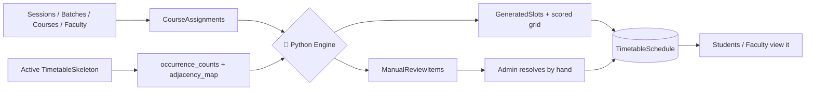

# 📅 Timetable — Academic Scheduling System

> Automated college timetable generation for NIT Goa. Feed it courses, faculty, rooms, and constraints — get back a clash-free timetable, a short list of "you deal with this one, human" items, and clean student/faculty portals to view it all.

Think of this project as **three specialists working together**:

```
   🗄️  DATA LAYER              🧠  THE BRAIN               👀  THE FACE
  (Node + MongoDB)      →     (Python engine)       →     (React frontend)
  "here are all the           "let me figure out           "here's your
   courses/faculty/            who goes where,               week, and here's
   rooms/rules"                 and here's what I             the stuff the
                                 couldn't figure out"          admin has to
                                                                eyeball"
```

If you remember nothing else from this README: **know which of these three a piece of logic belongs to before you go looking for it.** 90% of "where is this?!" confusion comes from looking in the wrong layer.

---

## 🧭 Table of Contents

1. [Why this exists](#1-why-this-exists)
2. [Tech stack](#2-tech-stack)
3. [Repo map](#3-repo-map)
4. [Running it locally](#4-running-it-locally)
5. [The data model](#5-the-data-model)
6. [🧠 The scheduling engine, in depth](#6-the-scheduling-engine-in-depth)
7. [Auth model](#7-auth-model)
8. [🚧 Known rough edges](#8-known-rough-edges)
9. [Deployment notes](#9-deployment-notes)
10. [Common workflows — "where do I look?"](#10-common-workflows--where-do-i-look)
11. [🚀 Future roadmap & optimization ideas](#11-future-roadmap--optimization-ideas)

---

## 1. Why this exists

Building a college timetable by hand is basically Sudoku, except the grid is 5 days × 8 periods × 2 "tracks", the numbers are professors who can't be in two places at once, some cells are secretly labs that eat two periods, and somebody's cousin insists two courses must always run at the exact same time. It's a genuine **constraint-satisfaction problem** — not an Excel job.

So the system is split into three layers that each own one part of the problem:

| Layer                       | Owns                                                                                  | Lives in                         |
| --------------------------- | ------------------------------------------------------------------------------------- | -------------------------------- |
| 🗄️ **Data setup**           | Source of truth — sessions, batches, courses, faculty, rooms, and the grid "skeleton" | Node/Express + MongoDB           |
| 🧠 **Scheduling**           | The actual placement algorithm                                                        | Python (spawned as a subprocess) |
| 👀 **Review & consumption** | Manual conflict resolution + everyone's view of the final timetable                   | React frontend                   |

---

## 2. Tech stack

| Layer                | Tech                                                                                                                |
| -------------------- | ------------------------------------------------------------------------------------------------------------------- |
| 🎨 Frontend          | React 19 · Vite 8 · Tailwind v4 · Zustand 5 · React Router v7 · Axios · Recharts · Chart.js · Framer Motion · jsPDF |
| ⚙️ Backend API       | Node.js (ESM) · Express 5 · Mongoose 9 · MongoDB driver 7                                                           |
| 🧠 Scheduling engine | Python 3, **standard library only** — no `requirements.txt`, no pip install, nothing                                |
| 🔐 Auth              | JWT (local email/password) + Google OAuth, locked to `@nitgoa.ac.in`                                                |
| 📧 Email             | Brevo — faculty invite emails only                                                                                  |
| 📤 Exports           | ExcelJS (admin `.xlsx`) · jsPDF (student/faculty PDF)                                                               |
| ☁️ Deployment        | Backend → Render · Frontend → Vercel                                                                                |

---

## 3. Repo map

```
timetable-main/
├── backend/
│   ├── index.js                       ⭐ Express entry point — every route gets mounted here
│   ├── config/initDB.js               Mongo connection
│   ├── seeder/                        Scripts to seed a fresh DB (read before running — they wipe stuff)
│   └── src/
│       ├── controllers/
│       │   ├── admin/                 One file per admin resource
│       │   ├── student/                Student-facing controllers
│       │   ├── Publictimetablecontroller.js   Shared reads (any logged-in role)
│       │   └── authController.js
│       ├── routes/
│       │   ├── admin/  student/       Route files, mirror the controllers
│       │   ├── Timetablepublicroutes.js   ⚠️ mounted with NO auth middleware (§8)
│       │   └── adminRoutes.js         💀 empty, dead file
│       ├── models/                    Mongoose schemas — see §5
│       ├── middleware/authMiddleware.js
│       ├── engine/bridge/timetableEngine.js   🌉 Node ↔ Python bridge
│       ├── python_engine/             🧠 THE ALGORITHM — see §6
│       ├── services/excelExportService.js
│       └── utils/                     Skeleton derivation, availability calc, track resolution
│
└── frontend/
    └── src/
        ├── pages/                     Student.jsx, Faculty.jsx, Incharge.jsx (= admin), HomePage, etc.
        ├── components/                Feature-grouped (Batch/, Course/, Incharge/, ...)
        ├── store/                     Zustand — one store per domain
        ├── services/                  Axios wrappers
        └── utils/apiPaths.js          BASE_URL + every API path
```

The three **portals** are literally the three `role` values on `User`:

| Portal            | Route      | Role      | How you log in                                                     |
| ----------------- | ---------- | --------- | ------------------------------------------------------------------ |
| 🛠️ `Incharge.jsx` | `/admin`   | `admin`   | email + password                                                   |
| 🎓 `Faculty.jsx`  | `/faculty` | `faculty` | **Google only**, and only after an admin invites you               |
| 📘 `Student.jsx`  | `/student` | `student` | email + password (your roll-number email does double duty, see §7) |

---

## 4. Running it locally

### You'll need

- Node.js 18+
- Python 3 (nothing to `pip install` — stdlib only 🎉)
- A MongoDB instance

### Backend

```bash
cd backend
npm install
```

There's no `.env.example` committed, so here's the full list reverse-engineered from every `process.env.*` in the code:

```env
PORT=5001
MONGO_URI=mongodb+srv://...
JWT_SECRET=some-long-random-string
FRONTEND_URL=http://localhost:5173     # baked into faculty invite emails
OAUTH_CLIENT_ID=your-google-oauth-client-id
BREVO_API_KEY=your-brevo-api-key       # only needed if you actually want invite emails to send
BREVO_SENDER_EMAIL=noreply@yourdomain.com
```

```bash
npm run dev     # nodemon
```

> ⚠️ `timetableEngine.js` spawns Python with `spawn("python3", [...])` — literally by name. Make sure `python3` resolves on your `PATH`, or generation will just silently fail to spawn.

### Frontend

```bash
cd frontend
npm install
npm run dev
```

> ⚠️ **Gotcha:** `frontend/src/utils/apiPaths.js` hardcodes `BASE_URL` to the _deployed_ Render backend, with the localhost line commented out:
>
> ```js
> // export const BASE_URL = "http://localhost:5001";
> export const BASE_URL = "https:yourURL.com";
> ```
>
> Flip the comment to point at your local backend, or you'll spend twenty minutes wondering why your changes "aren't showing up" — they're hitting production.

Also drop `VITE_OAUTH_CLIENT_ID` in `frontend/.env` for Google sign-in. Heads up: the backend only accepts `@nitgoa.ac.in` Google accounts (§7), so this won't fully work end-to-end unless you edit `authController.js` for your own domain.

### Seeding

`backend/seeder/` has `batchSeeder.js`, `courseSeeder.js`, `facultySeeder.js`. **Read them before running** — they wipe/upsert their target collection, they don't gently merge.

---

## 5. The data model

| Model                | What it is                                                                                                                                                                                                                                                                                                                              |
| -------------------- | --------------------------------------------------------------------------------------------------------------------------------------------------------------------------------------------------------------------------------------------------------------------------------------------------------------------------------------- |
| `User`               | Login identity for all 3 roles. One schema, role-specific fields (`faculty_code`, `student_code`, `current_sem`...) just sit unused for the roles that don't need them.                                                                                                                                                                 |
| `Faculty`            | The faculty _directory_ — separate from `User`. A logged-in faculty `User` links back via `faculty_code`.                                                                                                                                                                                                                               |
| `AcademicSession`    | A term — `{ academic_year, term: ODD\|EVEN }`. Almost everything else is scoped to one of these.                                                                                                                                                                                                                                        |
| `Batch`              | A dept/year/semester cohort (e.g. "CSE Year 2 Sem 3").                                                                                                                                                                                                                                                                                  |
| `Course`             | Catalog entry — type (`THEORY`/`LAB`), nature (`CORE`/`MINOR`/`ELECTIVE`/`PROJECT`/`SEMINAR`), weekly hours, credits.                                                                                                                                                                                                                   |
| `CourseAssignment`   | **The big one.** "This course, taught by this faculty, to these batches, this session." This is what actually feeds the engine. Carries `shared_lab_with` (⚠️ anti-affinity, not what it sounds like — see §6) and `synced_with` (force two assignments onto the same slot). No `room_id` — rooms are never a scheduling resource here. |
| `Room`               | Physical room, capacity — used for batch home-rooms and admin CRUD, **not** consulted by the engine at all.                                                                                                                                                                                                                             |
| `TimetableSkeleton`  | The **shape** of the grid: day × track × period cells, each labeled `A`–`F`, `G` (minor), `H` (OE), `TUT`, `1-CREDIT`, `LAB`, `BREAK`/`LUNCH`, or empty. Track 2 only exists Mon/Tue/Thu — it's an _alternate arrangement_ of that day, not an extra day.                                                                               |
| `TimetableSchedule`  | The **filled-in** grid for one generation run, plus admin overrides (`track_assignments`, `manual_entries`, `hidden_assignment_ids`).                                                                                                                                                                                                   |
| `GeneratedSlot`      | Raw intermediate output — "here's everyone sitting in label A this run."                                                                                                                                                                                                                                                                |
| `ManualReviewItem`   | The "you deal with this" pile. Three flavors — see §6.4.                                                                                                                                                                                                                                                                                |
| `CourseRegistration` | Student backlog/elective registrations.                                                                                                                                                                                                                                                                                                 |
| `Feedback`           | In-app bug reports / suggestions.                                                                                                                                                                                                                                                                                                       |
| ~~`Timetable`~~      | 💀 Dead code. References a `TimeSlot` model that doesn't exist anywhere else. Not imported by anything live.                                                                                                                                                                                                                            |

**The pipeline, end to end:**



---

## 6. 🧠 The scheduling engine, in depth

`backend/src/python_engine/` is the heart of this whole project, and honestly the part most worth actually understanding rather than skimming. It's on its **7th rewrite** (`slot_generator.py` literally has a changelog at the top going v2→v7 — read it, it explains _why_ rules changed, not just what they do now).

### 6.1 The cast of files

```
main.py               ── stdin/stdout adapter. One JSON in, one JSON out.
engine.py              ── the conductor: runs 1000 attempts, keeps the best
slot_generator.py      ── 🏋️ the heavy lifter — all constraint logic (~780 lines)
timetable_generator.py ── turns "buckets" into an actual grid
scorer.py              ── judges how "nice" a valid arrangement is
```

### 6.2 The flow of one generation run

1. **`build_slots()`** (in `slot_generator.py`) buckets every `CourseAssignment` into a skeleton label (`"A"`, `"LAB_MONDAY"`, etc.), respecting every hard constraint below. Anything it can't cleanly fit gets punted into `manual_review_items` instead of forced somewhere wrong.
2. **`generate_timetable()`** stamps those buckets onto the actual grid shape.
3. **`score_timetable()`** grades the result on _soft_ preferences only — this never affects whether something got placed, only how "good" the placement looks.
4. **`suggest_track_assignments()`** offers a best-guess for which lab-day arrangement (track 1 vs 2) suits each batch — purely a suggestion, the admin can ignore it entirely.

`engine.py` runs this whole thing **1000 times with different random seeds** and keeps the winner. Here's the fun part — winning isn't just "highest score":

> 🏆 **Tie-break priority: fewest `manual_review` items wins, first. Score is only the tiebreaker after that.**
> A gorgeous 98/100 arrangement that dumps 6 courses on the admin loses to an ugly 60/100 one that dumps zero. The whole point is minimizing human cleanup, not maximizing an abstract score.

### 6.3 The actual placement rules (as of v7)

These are the rules `slot_generator.py` hard-codes today — not a summary, the actual current behavior:

| #   | Rule                                                | What it means                                                                                                                                                                                                                                                                                                                                                                                                                    |
| --- | --------------------------------------------------- | -------------------------------------------------------------------------------------------------------------------------------------------------------------------------------------------------------------------------------------------------------------------------------------------------------------------------------------------------------------------------------------------------------------------------------- |
| 1️⃣  | **0-credit filter**                                 | 0-credit "courses" are dropped before anything else even looks at them. No slot, no manual-review entry — they just don't exist for this run.                                                                                                                                                                                                                                                                                    |
| 2️⃣  | **Priority placement**                              | 4- and 3-credit courses get first pick of slots (stable sort — ties keep their original order, so shuffling/load-balancing within a priority tier still works normally).                                                                                                                                                                                                                                                         |
| 3️⃣  | **Tutorials are never auto-placed**                 | Any `tutorial`-classified assignment goes straight to manual review, no matter how empty the `TUT` label looks. This is by design — tutorial timing is admin discretion, not something worth automating.                                                                                                                                                                                                                         |
| 4️⃣  | **Faculty back-to-back — tolerated, not forbidden** | A faculty member can be scheduled in two adjacent periods up to **2 times** before it's blocked. Those 2 get flagged (`adjacency_soft_violation`) so the scorer dings them — the 3rd+ hit is a hard block.                                                                                                                                                                                                                       |
| 5️⃣  | **Batch back-to-back — totally fine**               | Unlike faculty, a batch sitting in back-to-back periods is normal timetable structure and isn't restricted at all.                                                                                                                                                                                                                                                                                                               |
| 6️⃣  | **`synced_with` groups**                            | Linked assignments get resolved into connected components and anchored to whichever member needs the _fewest_ sessions/week. Members needing _more_ than the anchor offers → overflow. Members needing _fewer_ → choose-occurrences.                                                                                                                                                                                             |
| 7️⃣  | **`shared_lab_with` = anti-affinity, not merge** ⚠️ | This flipped meaning across versions and trips people up constantly. It used to mean "combine these into one block." Now it means the _opposite_: two linked lab assignments are **forbidden** from landing on the same lab day — they're competing for the same physical lab. Only recognized between two lab-classified assignments in the same run; a link to a non-lab assignment is silently ignored (a known gap, see §8). |
| 8️⃣  | **Zero-placement vs partial-placement**             | If literally nothing could be placed → `"unplaced"` (only fixable by squeezing into an empty minor/OE slot). If _some_ sessions placed but not enough → `"overflow"` (fixable into any free/shared-ok cell). These are deliberately different admin actions.                                                                                                                                                                     |

### 6.4 The manual-review pile — the 3 flavors

When the engine can't cleanly place something, it doesn't guess — it hands it to a human, tagged with exactly why:

| Kind                    | Trigger                                                                                                      | Admin's fix                                                                                |
| ----------------------- | ------------------------------------------------------------------------------------------------------------ | ------------------------------------------------------------------------------------------ |
| 🟠 `overflow`           | Needs _more_ sessions/week than any single label offers, OR it's a tutorial (always, by rule 3)              | Manually assign each leftover session to any free/allowed cell                             |
| 🔵 `choose_occurrences` | Needs _fewer_ sessions than the label it landed on provides                                                  | Pick which N of the label's available days to actually keep                                |
| 🔴 `unplaced`           | Got **zero** placement anywhere — usually because a batch has more courses than the 6 regular slots can hold | Squeeze it into an otherwise-empty minor (`G`) or OE (`H`) period — the _only_ option here |

### 6.5 Scoring — what "good" even means

`scorer.py`'s weights, verbatim:

```python
WEIGHTS = {
    "gap_penalty": 1,
    "uneven_distribution": 0.5,
    "faculty_consecutive": 3,   # the tolerated-but-flagged rule 4 hits
}
```

Pure math, zero placement logic — this file only ever judges an _already valid_ grid. It cannot rescue a bad placement, and (important!) it **can't fully validate a hand-edited grid either**: when an admin reworks the schedule directly, that path bypasses `slot_generator.py` entirely, so the `adjacency_soft_violation` flags this scorer relies on simply won't exist on those cells. `scheduleEditController.js` is supposed to run its own clash-check on save — it's the one place in the whole system where a hard violation can theoretically sneak back in.

### 6.6 The Node ↔ Python contract

`engine/bridge/timetableEngine.js` spawns `python3 main.py`, pipes one JSON blob into stdin, and expects exactly one JSON blob back on stdout (or a JSON error on stderr + non-zero exit).

> ⚠️ **There is no schema validation between the two sides.** If you change the payload shape in Node without updating `engine.py`'s `run()` docstring (or vice versa), you won't get a helpful error — you'll get a raw JSON-parse crash at runtime. Keep them in lockstep.

Want to poke the engine without going through Node at all?

```bash
cd backend/src/python_engine
python3 main.py < sample_payload.json
```

### 6.7 ⚠️ Known limitations of the engine itself

- **No room modeling at all.** Two courses can be validly placed in the same slot on paper with zero awareness of whether a physical room is free. `shared_lab_with` fakes "these need the same lab" for exactly one specific case, but there's no general resource model.
- **1000 attempts is a lot for a constraint-based approach.** The docstring itself admits this is now mostly about tie-breaking load balance, not "getting lucky" — worth profiling whether you actually need anywhere near that many.
- **`shared_lab_with` silently no-ops** if it points at a non-lab assignment — no warning, no error, just quietly ignored.
- **Rework can reintroduce hard violations** the scorer won't catch (see 6.5).
- **Batch adjacency has zero limits.** Fine 99% of the time, but there's no ceiling if you ever wanted one.

---

## 7. Auth model

- 📘 **Students** self-register with email/password. The registration handler literally regexes your email (`24EEE1002@...` → enrolled 2024, dept `EEE`), checks the currently active `AcademicSession`, and auto-fills your semester and year. Miss the pattern, or no active session exists yet? Those fields just come back `null` and the frontend is expected to prompt a profile setup step.
- 🎓 **Faculty can't self-register, period** — `register()` flat-out 403s a `role: "faculty"` request. The only path in is: admin invites you from the Faculty directory → you get a signed 24h JWT link via Brevo → you visit `/accept-invite` (which only _verifies_ the token, doesn't activate anything) → your account actually goes live the first time you sign in with Google.
- 🔒 **Google login is locked to `@nitgoa.ac.in`.** Anything else gets rejected with a 400 before any DB lookup even happens.
- `authMiddleware.js` gives you two building blocks: `protect` (verify JWT, load the user, attach `req.user`) and `authorizeRoles(...roles)` (403 if the role doesn't match). The pattern everywhere else is `router.use(protect)` then layering `authorizeRoles("admin")` on individual mutating routes.

---

## 8. 🚧 Known rough edges

Being upfront about these so nobody burns an afternoon rediscovering them:

- 🔴 **Biggest one: `admin/timetableRoutes.js` has zero auth middleware.** Generation, schedule reads, manual-review resolution, slot editing — all of it — is currently reachable with no token at all, unlike literally every other admin route file. Fix this before any real-world deployment.
- 🟡 **`Timetablepublicroutes.js`'s own comment contradicts its wiring.** The header says "mount this with `protect`" — `index.js` mounts it with nothing. Right now it's fully public, not "any logged-in role" like the comment implies. Pick one and fix the mismatch.
- 🔧 Hardcoded `BASE_URL` in `apiPaths.js` — should be a `VITE_API_BASE_URL` env var.
- 📄 No `.env.example` anywhere — see §4 for the reconstructed list.
- 💀 Three dead files: `routes/adminRoutes.js` (empty), `routes/student/timetableRoutes.js` (empty, unmounted), `models/timetableModel.js` (references a model that doesn't exist). Grep for imports before deleting any of them, but they all look safe.
- 🔤 Inconsistent casing: `Publictimetablecontroller.js`, `.Admin.js` vs `.admin.js` vs `.student.js` suffixes. Cosmetic, but annoying to grep around.
- 🧪 **Zero automated tests.** The engine is pure, deterministic-given-a-seed functions with no Mongo/Express dependency — it's the single best ROI place to start testing.
- 🤖 No CI at all.
- 📧 Google OAuth + Brevo both throw if their env vars are missing and that code path gets hit — worth guarding for a clean no-secrets local dev experience.
- 🏫 The whole auth layer is NIT-Goa-specific (domain check + roll-number regex) — reusing this elsewhere means editing `authController.js`.

---

## 9. Deployment notes

- **Frontend** → Vercel (`frontend/vercel.json` present).
- **Backend** → Render (`BASE_URL` in the frontend points at `https:https:yourURL.com`). Whatever host you use, make sure `python3` is actually available in that runtime — the engine subprocess needs it — and all the env vars from §4 are set.

---

## 10. Common workflows — "where do I look?"

| I want to...                                       | Go here                                                                                                                                                                                                                                                                                              |
| -------------------------------------------------- | ---------------------------------------------------------------------------------------------------------------------------------------------------------------------------------------------------------------------------------------------------------------------------------------------------- |
| Add a new admin-manageable resource                | Model in `models/` → controller in `controllers/admin/` → route in `routes/admin/` (mount with `protect` + `authorizeRoles("admin")`) → mount in `index.js` → a new file in `services/` and `store/admin/` → UI in `components/Incharge/`                                                            |
| Change _how_ the engine schedules things           | `slot_generator.py` (placement rules) · `scorer.py` (quality judging) · `timetable_generator.py` (bucket → grid). Keep `timetableEngine.js` and `engine.py`'s docstring in sync if the payload shape changes, and bump the version note — this codebase treats those docstrings as a real changelog. |
| Figure out why something landed in manual review   | Check `ManualReviewItem.kind` (§6.4) → trace back through `manualReviewController.js` / `scheduleEditController.js` → the matching `_overflow_item` / `_choose_occurrences_item` / `_unplaced_item` call in `slot_generator.py`                                                                      |
| Change what a student/faculty sees                 | `pages/Student.jsx` and `pages/Faculty.jsx` → `components/Student/` and `components/Faculty/` → the matching `services` file → the matching `store` file. Shared reads go through `Publictimetablecontroller.js` (currently unauthenticated, see §8)                                                 |
| Touch auth / add a role                            | `authController.js` + `authMiddleware.js` (backend) · `User.role` enum · `ProtectedRoute.jsx` + `getRoleHome.js` (frontend)                                                                                                                                                                          |
| Change the grid shape itself (days/periods/tracks) | `TimetableSkeleton` + `skeletonController.js` (backend, one active skeleton per session) · `utils/skeletonDerivation.js` (how the shape becomes engine input) · `SkeletonEditor.jsx` (frontend)                                                                                                      |

---

## 11. 🚀 Future roadmap & optimization ideas

Stuff that would meaningfully level this project up, roughly ordered by bang-for-buck:

### 🏗️ Foundation-level (do these first)

- **Lock down `admin/timetableRoutes.js`.** This is a real security hole, not a style nitpick — fix it before anything else on this list.
- **Add tests around the engine.** `slot_generator.py`/`scorer.py` are pure and deterministic-given-a-seed — a handful of fixture payloads covering rules 1–8 in §6.3 would catch regressions immediately, and there's currently zero safety net for a codebase that's already been rewritten 7 times.
- **Basic CI**: lint on push + a smoke test that runs `main.py` against a saved sample payload and asserts it doesn't crash.
- **A real `.env.example`** in both `backend/` and `frontend/`, generated once and kept in sync.

### ⚙️ Engine improvements

- **Model rooms as an actual resource.** Right now there's no concept of "this lab is physically occupied" beyond the one-off `shared_lab_with` hack — a real room-conflict check would remove a whole class of manual overrides admins currently have to catch themselves.
- **Profile and probably shrink `ATTEMPTS = 1000`.** Since v3, placement is constraint-checked at insertion time rather than blind-retry — the docstring itself says the 1000 seeds are now mainly for tie-breaking load balance. Measuring real generation time on a full department's data would tell you if 100 or 200 attempts get 95% of the benefit at a fraction of the runtime.
- **Validate `shared_lab_with` upstream**, at the `CourseAssignment` create/update step, so a link to a non-lab assignment throws a validation error instead of silently doing nothing three layers deeper in the engine.
- **Give rework a real clash-checker.** Right now `scheduleEditController.js` is "expected to" catch adjacency/double-booking problems on manual saves — making that an explicit, tested function (reusing the same clash logic `slot_generator.py` already has) would close the one remaining hole where a bad timetable can get saved.
- **Configurable rule weights.** The 2-instance faculty-back-to-back tolerance and the scorer's `WEIGHTS` dict are hardcoded — exposing these as session-level or institution-level settings would make the engine reusable beyond NIT Goa's specific preferences.

### 🎨 Frontend / UX

- Turn the manual-review queue into something closer to a checklist with progress ("4 of 11 resolved") rather than a flat list — it's the single most tedious part of the admin's job and deserves the most UX polish.
- Add a lightweight diff/preview view before an admin commits a rework edit, so they can see exactly what changed against the last generated version.
- Surface the engine's `suggested_track_assignments` more prominently — right now it's informational-only and easy to miss, but it's genuinely useful data the engine already computed for free.

### 🧹 Housekeeping

- Delete the three dead files flagged in §8 once confirmed unused.
- Standardize file-naming casing across controllers/routes.
- Move `BASE_URL` to a proper env var.
- Consider generalizing the NIT-Goa-specific auth logic (domain check, roll-number regex) behind a config value if this project is ever meant to be reused by another institution.

### 📈 Longer-term / ambitious

- **Multi-institution support** — parameterize the domain restriction, the roll-number parsing, and the skeleton's default template so this could genuinely be handed to another college without code edits.
- **Historical scoring analytics** — store score + manual-review-count per generation over time, so admins can see whether tweaking constraints session-over-session is actually helping.
- **A proper conflict simulator** for admins to test "what if I add this course" against the _current_ schedule without spawning a full 1000-attempt regeneration.

---

That's the whole map. If you're a junior picking this up: read §1 and §6 first, skim the table in §5 before touching any admin screen, and don't be afraid of the Python engine — it's dense, but every version bump explains itself in its own docstring. 🫡
